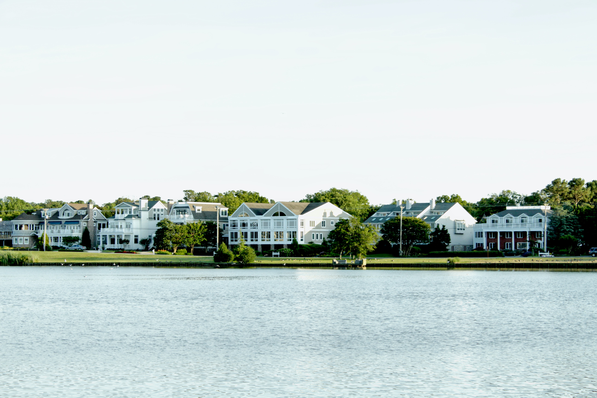
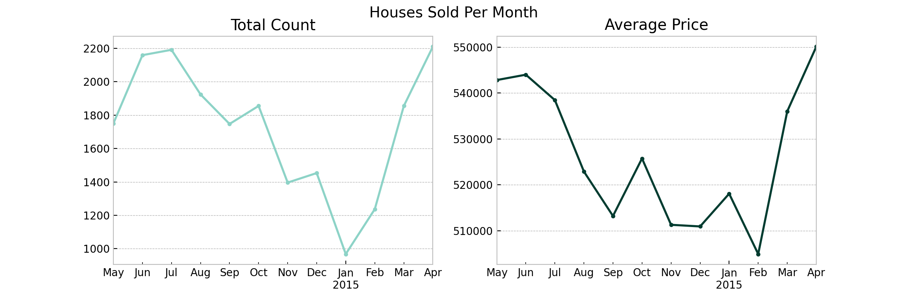

# Regression Analysis for Estimating Prices

## Overview

An analysis and regression modeling of over 21,000 real estate transactions in King County, Washington is completed to improve home valuation and real estate advisory. The findings include top features that are important to the *bestimate* model, which are square footage of living space, distance to Seattle, total distance to both Seattle and Redmond, distance to Redmond, and square footage of living space of the nearest 15 neighbors. The *bestimate* model that is the tuned random forest performs best in predicting house prices based on over 20 features. It explains 88% of the variance in the data and its predictions are USD 107,000 off from the actual prices on average.

## Business and Data Understanding

Real estate agencies in King County, Washington may be able to improve their advisory services by identifying important features that factor in home valuation based on relevant data. Doing so will allow real estate agents to provide more accurate prices to clients as supported by historical records. Using publicly available data, I describe patterns in real estate transactions such as features that likely drive prices.

The [King County data](https://www.kaggle.com/datasets/harlfoxem/housesalesprediction) spans a year between 2014 and 2015 with over 21,000 real estate transactions and 21 features, of which the dependent variable to predict is `price`. A full description of all column features is provided along with other data files, available in the repository's [data folder](https://github.com/czarinagluna/regression-analysis-for-estimating-prices/tree/main/data).

**Exploratory Data Analysis**

The highest peaks in the number of houses sold per month happened in the seasons of spring and summer. The decline in the months that followed dropped to the lowest point at the first month of the new year. As for the price of houses sold per month, the values followed roughly the same pattern.

Price is strongly correlated with `sqft_living`, `grade`, `sqft_living15`, `bathrooms`, and `bathrooms`. 

Let's visualize their relationships and distributions.

**Geospatial Mapping**

> "*Location, location, location*"

**Location is important in real estate and in analysis!**

Let's map the data points.

The concentrated geographic patterns reveal parts of the county populated by the more expensive houses represented by darker colors like the island at the center. The even more expensive houses sold for over a million dollars are located at about the same spots as the dark dots.

Locate the highest priced houses in the data in the following map:

**Interactive Maps**

I created choropleth maps ([map notebook](https://github.com/czarinagluna/regression-analysis-for-estimating-prices/blob/main/map.ipynb)) to further understand how house prices vary by location.

To interact with the maps, please use the [notebook viewer](https://nbviewer.org/github/czarinagluna/regression-analysis-for-estimating-prices/blob/main/map.ipynb).

## Data Modeling and Results

The dependent variable `price` is continuous and so I iterate over regression models: from simple to multiple linear regression, ridge and lasso regression, decision trees and finally, random forests. For hyperparameter tuning, I perform grid search ([code](https://github.com/czarinagluna/regression-analysis-for-estimating-prices/blob/main/gridsearch.ipynb)) to find the optimal parameters of decision trees and random forests.

**Model Performance**

**Baseline to *Bestimate* Model**

The baseline model `simple_lr` significantly improved to the `poly_tuned_rf`, our *bestimate* model:
* from an R-squared of 0.47 to 0.88, and
* from a Root Mean Squared Error of USD 217,000 to USD  107,000

To visualize the significant difference, let's plot how far away the predictions of the baseline model are to the actual prices versus how much closer the predictions of the bestimate model are:

For advisory, the top five features with the highest mean feature importances to the model are:
1. Square footage of living space
2. Distance to Seattle
3. Total distance to both Seattle and Redmond
4. Distance to Redmond
5. Square footage of living space of the nearest 15 neighbors

The other important features that follows are overall grade related to the construction and design of the house, quality of view from the house, zipcode, whether the house is on a waterfront, and square footage of lot.

**Model Deployment**

Finally, I deploy the Random Forest regression model ([demo](https://streamlit.io/)) as a prototype I develop for a client-facing application that serves as a Home Value Estimator.

***
SOURCE CODE: [Main Notebook](https://github.com/czarinagluna/regression-analysis-for-estimating-prices/blob/main/main.ipynb)

# Contact

Feel free to contact me for any questions and connect with me on [Linkedin](https://www.linkedin.com/in/czarinagluna/).
